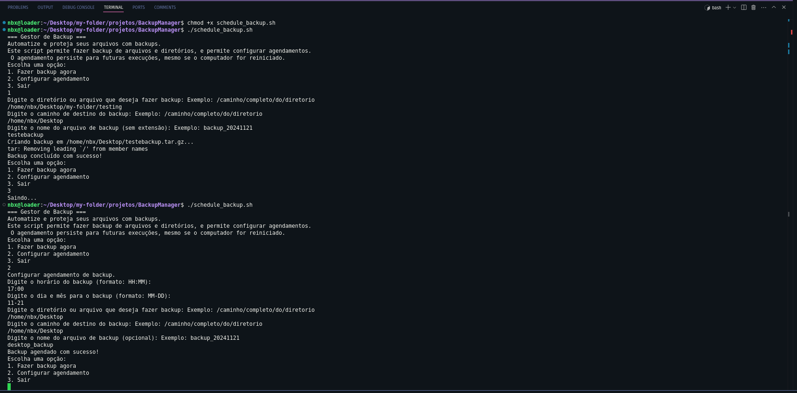

# BackupManager

**BackupManager** é um aplicativo em Shell Script projetado para automatizar e gerenciar backups de arquivos e diretórios no sistema Linux. 
Ele oferece uma interface simples e eficiente para realizar backups manuais ou agendados, além de registrar logs para consulta futura.

## 🚀 Funcionalidades

- **Backup Manual**: Compacta arquivos e diretórios em um único arquivo `.tar.gz`.
- **Agendamento de Backups**: Integração com o `cron` para configurar backups automáticos.
- **Logs de Backups**: Registra detalhes dos backups realizados, como data, hora e local.
- **Verificações de Diretórios**: Garante que os arquivos/diretórios de origem existam e cria o destino, se necessário.

## 🛠️ Requisitos

- Sistema Linux.
- Ferramentas pré-instaladas:
  - `tar`
  - `cron`
  - `bash`

## 📦 Como Instalar

1. Clone este repositório:
   ```bash
   git clone https://github.com/92username/BackupManager.git
   ```

2. Entre no diretório do projeto:
   ```bash
   cd BackupManager
   ```

3. Torne o script executável:
   ```bash
   chmod +x schedule_backup.sh
   ```

## 📋 Como Usar

Execute o script no terminal:

```bash
./schedule_backup.sh
```

### Menu de Opções

1. **Fazer Backup Agora**: Solicita o diretório/arquivo de origem, o destino (com padrão em `~/backups`) e o nome do backup.
2. **Configurar Agendamento**: Cria um novo agendamento recorrente e permite manter, substituir um existente ou substituir todos.
3. **Listar Agendamentos**: Exibe todos os agendamentos ativos com origem, destino, regularidade e horário.
4. **Remover Agendamento**: Remove um agendamento específico.
5. **Sair**: Encerra o programa.

## 📖 Exemplo de Uso

### Realizando um Backup Manual
1. Escolha a opção **1. Fazer Backup Agora**.
2. Insira o caminho do arquivo ou diretório a ser salvo.
3. Pressione `Enter` para usar o destino padrão `~/backups` ou informe outro caminho.
4. Insira o nome do arquivo de backup ou pressione `Enter` para usar o padrão.

O backup será salvo como um arquivo `.tar.gz` no local especificado.

### Configurando um Backup Automático
1. Escolha a opção **2. Configurar agendamento**.
2. Informe a regularidade em dias.
3. Pressione `Enter` para usar o horário padrão `02:00` ou informe um horário no formato `HH:MM`.
4. Pressione `Enter` para usar o destino padrão `~/backups` ou informe outro caminho.

O script adicionará automaticamente uma tarefa ao `cron` e controlará a execução recorrente de acordo com a regularidade em dias informada.

Se ja existirem agendamentos ativos, o app oferece tres opcoes:
- Manter os agendamentos atuais e adicionar um novo.
- Remover um agendamento especifico e criar o novo.
- Remover todos os agendamentos e criar o novo.

## 📝 Logs de Backups

Os backups realizados são registrados no arquivo `~/backup.log`, contendo:
- Data e hora do backup.
- Local do backup gerado.

### Exemplo de Log:
```
2024-11-21 14:35 - Backup criado: /home/user/backups/backup_20241121_1435.tar.gz
```
## Screenshots




## 🐛 Problemas Conhecidos

- Dependente do `cron` para agendamento.
